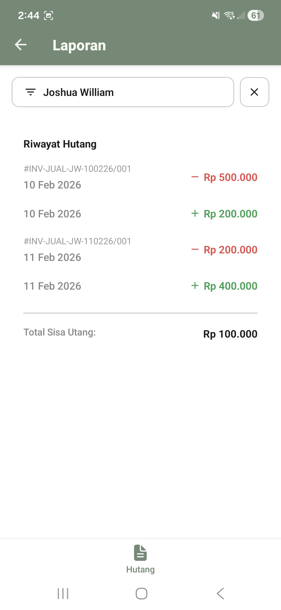
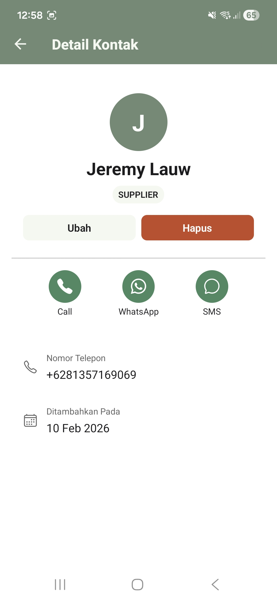
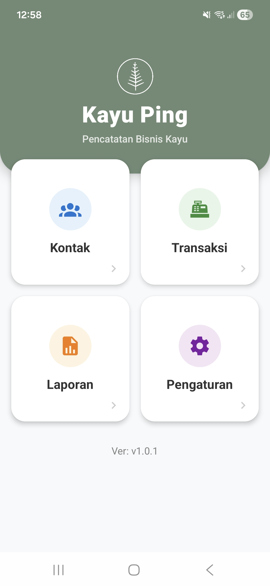

# Kayu Ping - Invoice & Debt Management App

A comprehensive mobile application for managing invoices, payments, and debt tracking. Built with modern React Native technologies, Kayu Ping provides an intuitive interface for small businesses and entrepreneurs to efficiently monitor financial transactions.

## 📸 Screenshots

|               Invoice List                |                Invoice Detail                 |               Debt Report               |               Add Payment               |
| :---------------------------------------: | :-------------------------------------------: | :-------------------------------------: | :-------------------------------------: |
|  |  |  |  |

|                Contact Detail                 |           Home            |
| :-------------------------------------------: | :-----------------------: |
|  |  |

## ✨ Key Features

### Invoice Management

- **Create & Organize Invoices**: Manage sales and purchase invoices with automatic invoice code generation
- **Flexible Filtering**: Filter invoices by contact, date range (day/week/month/year), and payment status
- **Invoice Details**: View comprehensive invoice information including entry date, contact details, and payment history
- **Date Navigation**: Easy navigation between custom date ranges with intuitive controls

### Payment Tracking

- **Payment Allocation**: Allocate payments to specific invoices for accurate debt tracking
- **Payment Methods**: Support for multiple payment methods (cash, bank transfer, others)
- **Payment History**: Complete audit trail of all transactions with timestamps

### Debt Management

- **Real-time Debt Calculation**: Automatic calculation of remaining debt based on invoices and payments
- **Debt Report**: Comprehensive view of all transactions (invoices and payments) for selected contacts
- **Visual Indicators**: Color-coded transactions (red for invoices, green for payments) for quick recognition
- **Total Debt Summary**: At-a-glance view of total remaining debt per contact

### Contact Management

- **Contact Database**: Maintain a comprehensive contact list with phone numbers and notes
- **Contact Categories**: Organize contacts by category (supplier, client, driver, others)
- **Quick Search**: Fast contact lookup with real-time search functionality

## 🏗️ Architecture & Tech Stack

### Frontend

- **React Native** - Cross-platform mobile development framework
- **Expo** - Modern React Native development and deployment platform
- **Expo Router** - File-based routing for React Native
- **React Hooks** - State management and side effects

### Backend & Database

- **Drizzle ORM** - Type-safe SQL query builder for TypeScript
- **SQLite** - Lightweight, embedded database for local storage
- **Drizzle Migrations** - Schema versioning and database evolution

### UI & Styling

- **React Native** - Native UI components
- **StyleSheet** - Optimized styling for React Native
- **Material Community Icons** - Comprehensive icon library
- **Custom Theme System** - Centralized color and spacing constants

### Tools & Development

- **TypeScript** - Static type checking for safer code
- **ESLint** - Code quality and consistency
- **Babel** - JavaScript transpilation
- **Metro** - JavaScript bundler for React Native

## 📁 Project Structure

```
kayu-ping-app/
├── app/                          # Expo Router app directory
│   ├── (tabs)/                   # Tabbed navigation screens
│   │   ├── invoice.tsx           # Invoice list with filters
│   │   └── payment.tsx           # Payment management
│   ├── contact/                  # Contact management pages
│   │   ├── add.tsx
│   │   ├── index.tsx
│   │   └── [id]/                 # Dynamic contact detail routes
│   ├── invoice/                  # Invoice detail pages
│   │   ├── add.tsx
│   │   └── [id]/
│   │       ├── edit.tsx
│   │       └── index.tsx
│   ├── payment/                  # Payment pages
│   │   ├── add.tsx
│   │   └── [id]/
│   ├── reports/                  # Reporting & analytics
│   │   └── debt.tsx              # Debt report screen
│   ├── _layout.tsx               # Root layout
│   └── index.tsx                 # Home screen
├── db/                           # Database layer
│   ├── client.ts                 # Database client initialization
│   └── schema.ts                 # Drizzle schema definitions
├── drizzle/                      # Database migrations
│   ├── *.sql                     # Migration files
│   └── meta/                     # Migration metadata
├── components/                   # Reusable UI components
│   ├── Container.tsx
│   ├── DeleteModal.tsx
│   └── PaymentAllocation.tsx
├── constants/                    # App constants
│   └── theme.ts                  # Color palette & spacing system
├── hooks/                        # Custom React hooks
│   └── useDeleteConfirm.ts
├── lib/                          # Utility functions
│   ├── utils.ts
│   ├── dayjs-config.ts
│   ├── label-helper.ts
│   └── image-helper.ts
├── assets/                       # Static assets
│   └── images/
└── android/                      # Android native code

```

## 🗄️ Database Schema

The application uses a relational SQLite schema with the following core entities:

### Contacts

```typescript
- id: Primary key
- name: Contact name
- phoneNumber: Unique phone number
- category: supplier | client | driver | others
- notes: Optional contact notes
- createdAt: Timestamp
```

### Invoices

```typescript
- id: Primary key
- code: Unique invoice code
- entryDate: Invoice date
- contactId: Foreign key to contacts
- amount: Invoice total amount
- type: sales | purchase
- notes: Optional notes
- mediaUri: Optional photo/attachment
- createdAt: Timestamp
```

### Payments

```typescript
- id: Primary key
- paymentDate: Payment date
- contactId: Foreign key to contacts
- amount: Payment amount
- method: cash | bank_transfer | others
- type: income | expense
- notes: Optional notes
- mediaUri: Optional photo/attachment
- createdAt: Timestamp
```

### Payment Allocations

```typescript
- id: Primary key
- paymentId: Foreign key to payments
- invoiceId: Foreign key to invoices
- amount: Allocated amount to invoice
- createdAt: Timestamp
```

## 🚀 Getting Started

### Prerequisites

- Node.js (v16 or higher)
- npm or yarn
- Expo CLI
- Android Studio (for Android development) or Xcode (for iOS)

### Installation

1. Clone the repository:

```bash
git clone https://github.com/yourusername/kayu-ping-app.git
cd kayu-ping-app
```

2. Install dependencies:

```bash
npm install
```

3. Set up the database:

```bash
npx drizzle-kit migrate
```

4. Start the development server:

```bash
npm start
```

5. Run on Android or iOS:

```bash
# Android
npm run android

# iOS
npm run ios
```

## 💾 Database Migrations

The project uses Drizzle Kit for schema management:

```bash
# Generate new migration
npx drizzle-kit generate:sqlite

# Push migrations to database
npx drizzle-kit migrate

# Reset database (development only)
npx drizzle-kit drop
```

## 🎨 Design System

The application implements a cohesive design system with:

- **Color Palette**:
  - Primary: `#718974` (Green)
  - Accent: `#468962` (Dark Green)
  - Text: `#1C1C1E` (Dark Gray)
  - Border: `#c1c1c1` (Light Gray)
  - Secondary: `#F4F7F1` (Off White)
  - Danger: `#c24a26` (Red)

- **Spacing System**: xs (4px), sm (8px), md (16px), lg (24px)

## 🔑 Key Functionalities

### Smart Invoice Filtering

- Filter by contact with real-time search
- Date range filtering with multiple granularity options
- Payment status filtering (paid/unpaid)
- Type filtering (sales/purchase)

### Payment Allocation

- Allocate payments to specific invoices
- Track partial payments
- Visual representation of payment status

### Financial Analytics

- Real-time debt calculation per contact
- Total unpaid amount tracking
- Transaction history with chronological sorting
- Remaining balance computation

## 📱 User Interface Highlights

- **Intuitive Navigation**: File-based routing with Expo Router
- **Modal Dialogs**: Smooth bottom-sheet modals for filtering and selection
- **Responsive Design**: Optimized layouts for various screen sizes
- **Visual Feedback**: Loading indicators, empty states, and success/error messages
- **Accessibility**: Touch-friendly interface with clear visual hierarchy

## 🛠️ Development Workflow

### Code Quality

- TypeScript for type safety
- ESLint for code consistency
- Organized component structure

### State Management

- React Hooks (useState, useEffect, useCallback)
- Focus effect for screen lifecycle management
- Debounced search for performance optimization

## 📈 Performance Considerations

- **Efficient Data Loading**: Pagination support for large datasets
- **Optimized Re-renders**: Memoization and callback stabilization
- **Debounced Search**: 100ms delay for contact search
- **Local Caching**: SQLite for instant data access

## 📝 License

This project is licensed under the MIT License - see the LICENSE file for details.

## 👤 Author

Joshua William

---

**Built with ❤️ using React Native and Expo**
